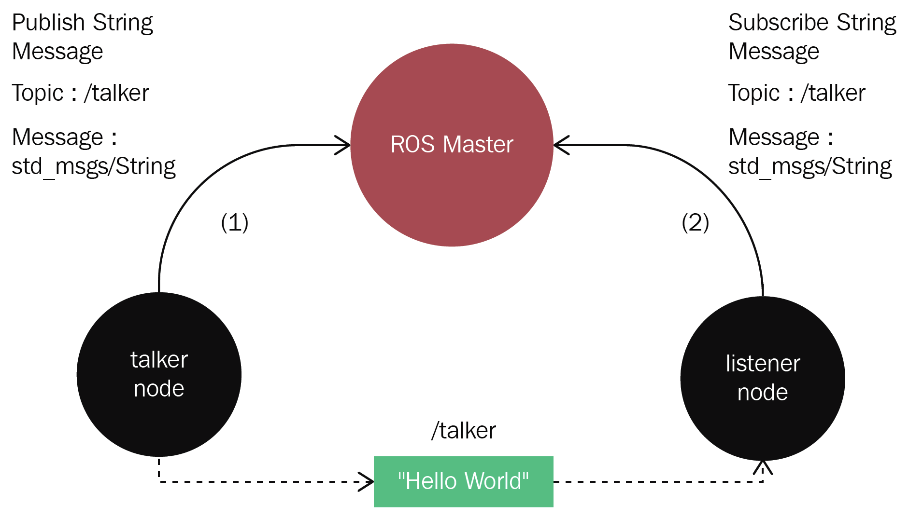

# Ch1 Intro

[ROS/Concepts - ROS Wiki](http://wiki.ros.org/ROS/Concepts)

- File System

  1.  metapackage : 針對特定需求的一系列套件組合

  2.  package : 單一套件

  3.  manifest :套件清單，每個套件都會有一個`manifest.xml`記錄所有套件的清單

  4.  message : ROS 藉由發布 message 檔案來相互溝通

  5.  service : 各項路徑定義在`our_package/srv/service_files.srv`

  6.  code : code

  7.  misc file : 雜物

- Computational Level

  ROS Computational Leve 是可以處理所有資訊的 P2P 網路，包含 Node,Topic,Message,master,parameter server 等等

  1.  Node : 使用 ROS API 來互相通訊的 Process，ROS 系統可能用一個或多個 Node 進行計算。

  2.  Master : 扮演 Node 間的中介節點，協助不同 ROS 互相連接。Master 透過交換各節點的詳細資料來達成各個節點相互溝通的功能。

  3.  Parameter Server: 可在此設定共同參數與權限，如果設為全域變數則所有 Node 都可以存取參數。

  4.  Topic : 兩節點間互相溝通的方式，藉由發送與訂閱者的角色來傳遞資料。

  5.  Service : 另一種通訊方式，藉由發出 Request 來請求對方 reply。

  6.  Bag : 用來記錄與重播 ROS Topic 的功用程式。

- Community Level

  版本、儲存庫、Wiki、寄存清單、答案集、部落格

- ROS 通訊

  

  ROS 的通訊方式有關於剛剛提到的 Node 與 Master。

  首先 Node 分為 talker 與 listener，他們都會各自的詳細資料(Message,topic,role 等等)。當 talker 首次啟用時，Node 會與 master 做聯繫並給發布節點的 URI。Master 會維護各個節點的詳細資料表格，而當 Listener 啟用時，也會去聯繫 Master，當同一主題有 talker 和 listener 時，master 就會把 URI 給 listener，從此刻開始 talker 和 listener 就可以直接溝通，不用透過 master。

  配對流程如下

  1.  talker 啟動

  2.  talker 連接 master 交換資料

  3.  listener 啟動

  4.  listener 連接 master 交換資料

  5.  talker 與 listener 配對完成

- ROS Client 函式庫

  - roscpp (效能首選)

  - rospy 易於開發(我們應該是用這個)

  - roslisp 常用於規劃函式庫
